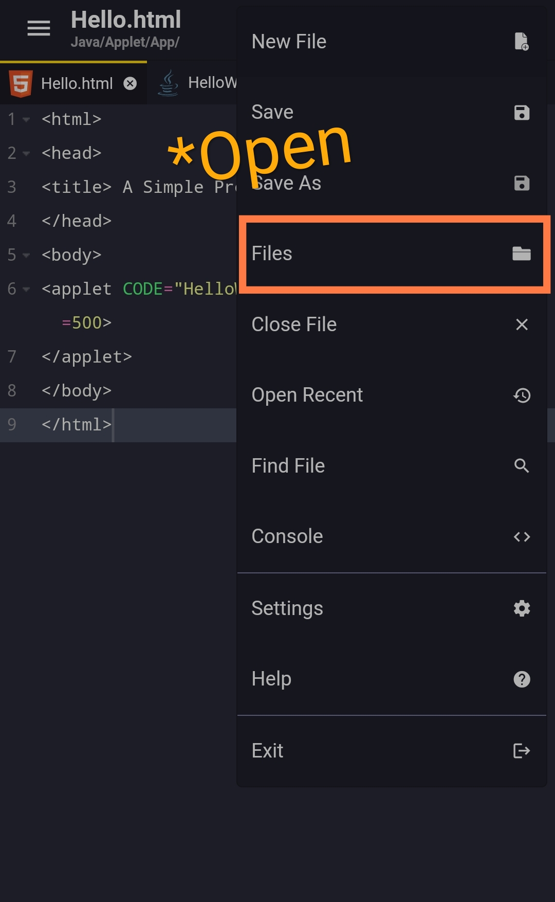

# java-applets-on-android
__Java applets allow you to run Graphical programs in web-browsers, 
On web-browsers that support applets(java)__ 

> Several applets are deprecated, due to the removal of Java plug-in support
> from modern browsers and Oracle JDK/JRE.
##
#### Description
__Run Java Applets, Which have been deprecated from most browsers, on Android__([Termux](https://termux.dev/en/)+[Acode](https://acode.foxdebug.com/)+[Kiwi Browser](https://kiwibrowser.com/)); 

***
## Installation
> __Dowload f-droid from [*here*](https://f-droid.org/F-Droid.apk)__
>
<details open>
<summary>Termux</summary></br>

 [__Termux Download__](https://f-droid.org/repo/com.termux_118.apk)
- Termux is a free and open-source terminal emulator 
for Android which allows for running a Linux 
environment on an Android device.

- In addition, various software can be installed 
through the application's package manager.
</details>

##
<details open>
<summary>Acode</summary></br>

 [__Acode Download__](https://f-droid.org/repo/com.foxdebug.acode_272.apk)
- Acode is a code editor that's as powerful as 
it is lightweight, designed to help you edit HTML, text, and JavaScript 
from the comfort of your Android smartphone. 
With this app, you can create and manage websites 
or edit any file you want in Python, CSS, HTML, Java, JavaScript, Dart, and more.

- Keep in mind that even though you can only run 
programs in HTML, MarkDown, and JavaScript, 
you can use Termux to execute programs in 
Python, PHP, Java, and C ++, for example.
</details>

##
<details open>
<summary>Kiwi Browser</summary></br>

 [__Kiwi Browser Download__](https://play.google.com/store/apps/details?id=com.kiwibrowser.browser)
- Kiwi Browser for Android is a popular Chromium-based 
browser like Google Chrome and Microsoft Edge.
 It is now fully open source.

- The app added something that no other 
browser on Android has — support for desktop 
Chrome extensions. That's right, nearly 
every extension that works on Chrome will 
work on Kiwi.
</details>

***
### Setup Kiwi Browser

__*Open *Kiwi Browser* App__
##
([__Crome Extentions__](https://chrome.google.com/webstore/category/extensions))

- Open This ([*LINK*](https://chrome.google.com/webstore/detail/cheerpj-applet-runner/bbmolahhldcbngedljfadjlognfaaein/related)) in Kiwi-Browser,
To Dowload `CheerpJ Applet Runner` extention.
> CheerpJ Applet Runner extension for Chrome and Edge, \
allows you to run Java Applets without a Java 
plugin or installation. \
[CheerpJ Applet Runner](https://chrome-stats.com/d/bbmolahhldcbngedljfadjlognfaaein/download)
***
### Setup Termux

__*Open *Termux* App__

__Type The Following Commands__ :-

`apt update && apt upgrade`

_Give Y as input when promted_
##
`termux-setup-storage`
> run this command two times

_Give Y as input when promted_
##
`pkg install openjdk-17`
> Install's Java and Java Compiler (javac)

`cd {You Working directory for Java}`
> Make a directory in Internal storage(/storage/emulated/0/) for easy access
***
<details>
<summary>Example HelloWorld.java:</summary></br>
 
``` java
 import java.applet.*;
 import java.awt.Graphics;

 public class HelloWorld extends Applet{
   public void paint(Graphics g){
     g.drawString("Hello, World !", 50, 50);
   }
 }   
```

</details>

<details>
<summary>Example Hello.html</summary></br>{

``` html
<html>
<head>
<title> A Simple Program </title>
</head>
<body>

<applet CODE="HelloWorld.class" WIDTH=500 HEIGHT=500>
</applet>
</body> 
</html>
```
}
</details>

***

### Setup Acode

__*Open *Acode* App__



_Go to (Three-dots>Files), Select a Directory as root Directory for Acode_.
Where your files are kept.

